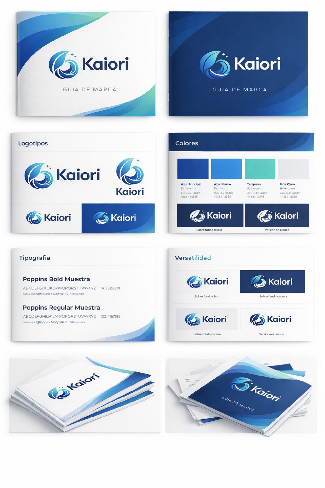

# Guia de marca Kaiori

## Archivos de marca

Activos ubicados en el proyecto:

- Guia visual completa: `public/assets/brand/guia-de-marca-kaiori.png`
- Logo principal optimizado: `public/assets/brand/kaiori-logo-500.png`
- Logo anterior de referencia: `public/assets/brand/kaiori-logo.jpg`
- Favicon: `public/favicon.svg`

Rutas para usar desde la web:

- `/assets/brand/guia-de-marca-kaiori.png`
- `/assets/brand/kaiori-logo-500.png`
- `/assets/brand/kaiori-logo.jpg`
- `/favicon.svg`

> Nota: `kaiori-logo-500.png` es el logo principal para la web. El archivo anterior `KAIORI-logo.png` contenia datos JPEG, por eso se conservo como `kaiori-logo.jpg` solo como referencia.

## Vista previa

## Analisis visual

La marca Kaiori se apoya en una identidad fluida, limpia y vinculada a ideas de agua, movimiento, frescura, claridad y cuidado. El simbolo combina una forma organica tipo ola/hoja con trazos circulares y destellos, lo que sugiere analisis, mejora, limpieza visual y transformacion.

El conjunto transmite:

- Confianza.
- Frescura.
- Profesionalidad.
- Movimiento y mejora continua.
- Sensacion de claridad y orden.

## Logotipo

Versiones detectadas:

- Logotipo horizontal con simbolo a la izquierda y palabra Kaiori a la derecha.
- Isotipo independiente.
- Version compacta o apilada.
- Version sobre fondo claro.
- Version sobre fondo oscuro.
- Version en blanco para fondos oscuros.

Uso recomendado:

- Priorizar el logotipo horizontal en cabecera, hero y piezas principales.
- Usar el isotipo cuando el espacio sea reducido o como elemento de apoyo visual.
- Usar la version clara/color sobre fondos blancos o muy claros.
- Usar la version blanca o adaptada sobre fondos azul oscuro.
- Mantener suficiente aire alrededor del logo.
- No deformar, rotar, cambiar proporciones ni aplicar sombras agresivas.

## Paleta

Paleta principal aplicada en la web:

- Azul principal: `#214C9A`.
- Azul oscuro: `#193B77`.
- Azul medio: `#4A9BF9`.
- Turquesa: `#62DDD0`.
- Gris claro: `#E9E9EE`.
- Fondo claro: `#F7F8FC`.

Lectura de marca:

- El azul oscuro aporta confianza, criterio y solidez.
- El azul medio aporta tecnologia, claridad y accion.
- El turquesa aporta frescura, diferenciacion y sensacion de mejora.
- Los grises claros permiten una interfaz limpia y profesional.

## Tipografia

Tipografia principal:

- Poppins.

Usos recomendados:

- Semibold o bold para titulares.
- Medium para botones, navegacion y pequenas etiquetas.
- Regular para textos largos.

La tipografia debe sentirse moderna, geometrica y clara. Conviene evitar pesos demasiado finos en textos importantes.

## Estilo grafico

Elementos visuales presentes en la guia:

- Fondos blancos y azul oscuro.
- Ondas fluidas en azul y turquesa.
- Composiciones limpias con mucho espacio.
- Tarjetas o laminas de marca con sombras suaves.
- Contraste entre superficies claras y bloques de color profundo.

Aplicacion recomendada en la web:

- Mantener fondos claros para lectura.
- Reservar azul oscuro para bloques de impacto, CTA y zonas de marca.
- Usar turquesa como acento, no como color dominante.
- Mantener sombras suaves y bordes limpios.
- Evitar saturar la pagina con demasiadas ondas decorativas.

## Implicaciones para la landing

La landing actual ya sigue gran parte de la guia:

- Usa Poppins.
- Usa azul principal, azul medio y turquesa.
- Aplica tarjetas limpias y fondos claros.
- Usa secciones oscuras para contraste.
- Incluye logotipo, paleta y ejemplos de aplicacion.

Mejoras aplicadas:

- Sustituir el logo JPG recortado por `kaiori-logo-500.png`, un PNG real con transparencia.
- Usar el logo oficial en la cabecera con proporcion natural y sin recorte.

Mejoras posibles:

- Usar la guia de marca como referencia visual en la seccion "Guia visual".
- Extraer isotipo independiente para favicon y usos pequenos.
